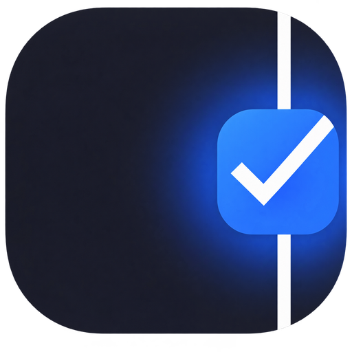

<p align="center">
  
</p>

# SideLine

**Your tasks, right beside your work.**

An offline Windows to-do app that docks to your screen edge. Keep tasks within reach, add context with notes, and collapse the sidebar when you want more space.

**[Download for Windows x64](https://github.com/lat1bulate/SideLine/releases/latest)** · [Release notes](https://github.com/lat1bulate/SideLine/releases) · [Report an issue](https://github.com/lat1bulate/SideLine/issues) · [简体中文](README.zh-CN.md)

> **Interface language:** the current app UI is in Chinese. This English README describes the app; it does not introduce an English UI.

## Why SideLine?

- **Stay beside your work.** Dock to the left or right edge, toggle always-on-top, or collapse to a narrow strip. Click the strip to expand it again.
- **Make room instead of covering things.** Windows AppBar integration reserves desktop space for maximized windows. The sidebar automatically hides when a foreground full-screen window is detected.
- **Keep context with each task.** Drag pending tasks to reorder them, edit text, and attach multiple notes. Completed tasks live in a collapsible section.
- **Local-first, without an account.** Tasks and preferences are stored as local JSON files. There is no cloud sync or sign-in flow.
- **Recover instead of starting over.** Serialized saves, atomic file replacement, backups, visible errors and explicit recovery help protect your work. File conflicts can preserve unsaved edits before reloading.

Built with **Tauri 2 + Rust + plain JavaScript**. Uses the system's WebView2 runtime rather than shipping a bundled browser runtime.

## Download and run

1. Open the [latest release](https://github.com/lat1bulate/SideLine/releases/latest).
2. Download `Sideline-v0.1.0-windows-x64.zip` and extract it to a folder of your choice.
3. Run `Sideline.exe`.

No application installer is required. **Your data is stored in your Windows application-data directory, not beside the executable**; this is not a fully portable data setup.

### Requirements and security

- An x64 Windows installation supported by Microsoft Edge WebView2. This release targets Windows; macOS, Linux and native ARM64 builds are not provided.
- [Microsoft Edge WebView2 Runtime](https://developer.microsoft.com/en-us/microsoft-edge/webview2/). If the runtime is missing, install it from Microsoft.
- The executable is **not code-signed**. Windows may show a reputation or security warning. Verify the download source and checksum; do not disable Windows security protections.
- The release includes `SHA256SUMS.txt` to check download integrity. A checksum is not a substitute for a publisher signature.

```powershell
Get-FileHash .\Sideline-v0.1.0-windows-x64.zip -Algorithm SHA256
```

Compare the result with the ZIP entry in the release's checksum file.

## Everyday use

| Action | How |
| --- | --- |
| Add a task | Type in the input and press Enter, or click the add button. |
| Reorder | Drag a pending task's row or handle. |
| Edit task text | Double-click or right-click its text. |
| Add a note | Click the task's `+` button. |
| Edit a note | Double-click or right-click the note. |
| Undo a deletion | Use the Undo control, or Ctrl+Z outside a text editor. |
| Show completed tasks | Expand the completed section at the bottom. |
| Change docking or always-on-top | Right-click an empty area to open the app menu. |
| Expand the collapsed sidebar | Click anywhere on the collapsed strip. |

SideLine remembers docking, collapsed state, always-on-top and completed-section expansion. Closing the app waits for queued saves; failed writes are shown rather than silently discarded.

## Data and known limitations

Data lives in `%APPDATA%\com.yan.sideline\`. Back up that directory before moving between computers. The application keeps backups for recovery, but they do not replace your own backup strategy.

- Registering or removing a Windows AppBar can cause Windows to rearrange desktop icons. SideLine does not promise a zero-impact desktop layout.
- Display scaling, multi-monitor layouts and full-screen behavior can vary by setup. Include your Windows version, display scaling and monitor layout when reporting problems.
- The interface is currently Chinese. Cloud sync, reminders, search and global shortcuts are not included.
- This is an early release. Review the [release notes](https://github.com/lat1bulate/SideLine/releases) before upgrading, and quit the old instance before replacing the executable.

## Build from source

Use a **Windows** development environment with Rust's MSVC toolchain, Visual Studio C++ Build Tools, the Windows SDK and WebView2. Windows Python 3 is needed for the post-build icon step.

From the repository root:

```powershell
cargo build --manifest-path src-tauri/Cargo.toml --release --locked
python tests/package_icons.py src-tauri/target/release/sideline.exe
```

Output: `src-tauri/target/release/sideline.exe`. Do not run the icon step while that executable is running. It restores transparent PNG icon resources after the build.

For a cached/offline build, `python tests/build_windows.py production` copies the executable to `tests/artifacts/Sideline.exe`. Run `python tests/package_icons.py tests/artifacts/Sideline.exe` afterward. The build script uses `--offline`, so dependencies must already be cached.

## Tests

Rust storage and Windows file-operation tests:

```powershell
cargo test --manifest-path src-tauri/Cargo.toml --locked
```

Front-end DOM tests (Node.js and `jsdom` required):

```powershell
npm install --no-save --package-lock=false jsdom
node --test tests/frontend.test.cjs
```

Browser tests use Microsoft Edge with synthetic tasks and mocked Tauri IPC:

```powershell
python -m venv tests/.venv
tests/.venv/Scripts/python.exe -m pip install playwright
tests/.venv/Scripts/python.exe tests/browser_smoke.py
tests/.venv/Scripts/python.exe tests/browser_features.py
tests/.venv/Scripts/python.exe tests/browser_recovery.py
tests/.venv/Scripts/python.exe tests/browser_edge_cases.py
```

Native tests require `python tests/build_windows.py qa` first. They use a separate QA application identity, but they do open windows and exercise Windows AppBar behavior. Read the scripts before running them. `tests/deploy_verified.py` backs up and replaces a desktop executable; **it is a deployment tool, not an ordinary test**.

## Repository layout

- `dist/` — actual HTML, CSS and JavaScript source embedded by Tauri; **do not discard it as generated output**.
- `src-tauri/` — Rust application, Windows AppBar integration, storage, configuration and icons.
- `icon_pngs/` — transparent PNG resources for post-build icon repair.
- `tests/` — regression tests, build helpers and packaging helpers.
- `docs/` — design scope and release documentation.

Real tasks, local backups, test browser profiles, virtual environments and compiled binaries are excluded from Git.

## Feedback

Found a problem or have a focused improvement in mind? [Open an issue](https://github.com/lat1bulate/SideLine/issues) with steps to reproduce it. Redact private tasks, file paths and screenshots before sharing.

If SideLine is useful to you, a star helps others discover the project.
